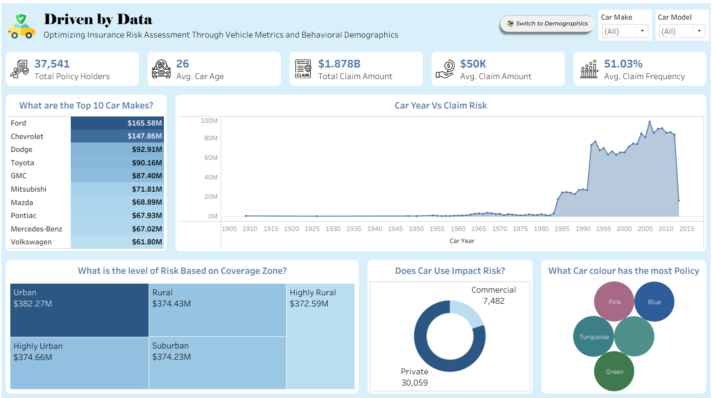
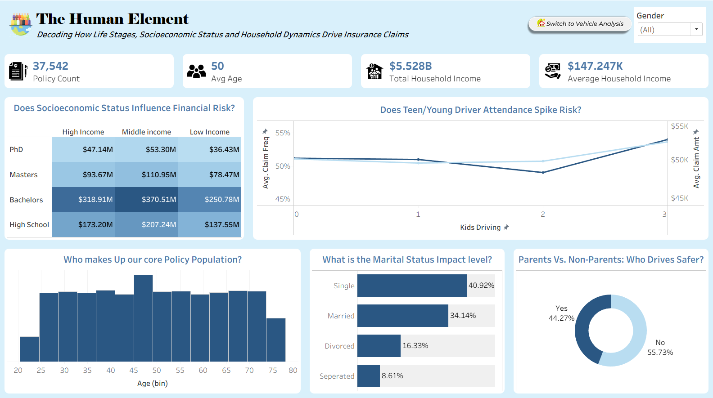
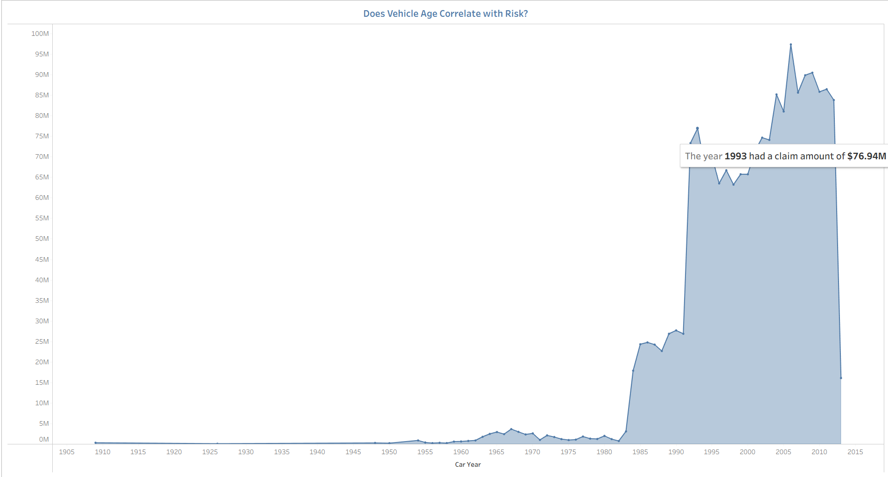
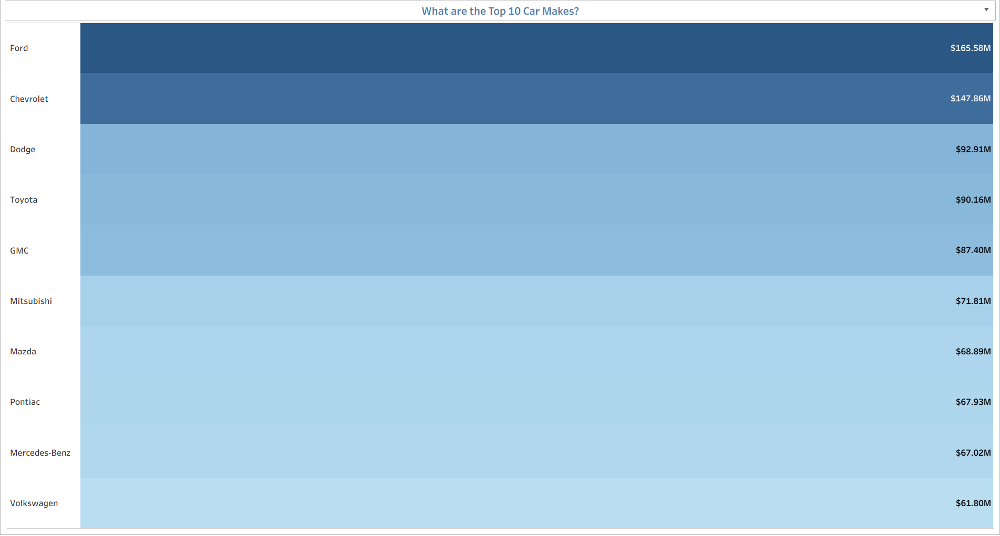
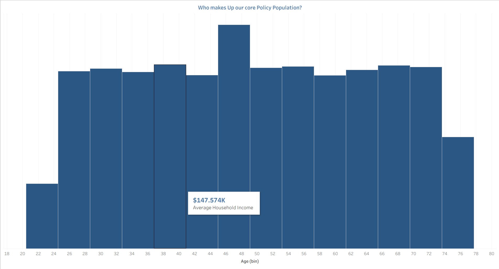
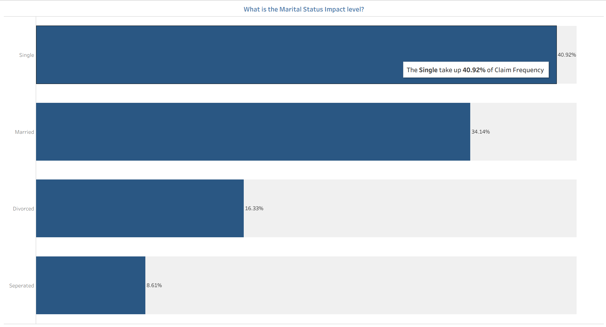
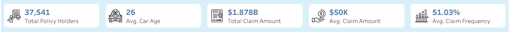
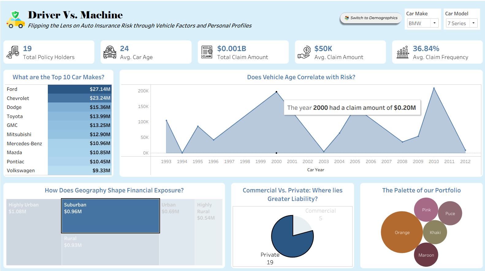

# 📊 The Risk Spectrum: Dissecting Vehicle Metrics & Driver Profiles

## 🧾 Project Overview

Insurance risk is influenced by a combination of vehicle characteristics and driver demographics, yet these factors are often analyzed in isolation. This project uses an interactive Tableau dashboard to bridge that gap by providing a dual-perspective analysis of insurance claim risk.

🔗 View the Interactive Dashboard: [\[The Risk Spectrum: Dissecting Vehicle Metrics & Driver Profiles\]](https://public.tableau.com/app/profile/oghenefejiro.ugbama/viz/InsurancePolicyProject/AssetRiskandEnvironmentalFactors)

---

## 📂 Dataset Overview

The dataset contains **37,542 insurance policy records** and includes information on policyholders, vehicles, and claim activity.

### Key Data Categories

* Driver demographics (Age, Gender, Marital Status, Education Level)
* Vehicle information (Make, Model Year, Color, Usage Type)
* Insurance claim metrics (Claim Frequency and Claim Amount)
* Financial indicators (Household Income)
* Geographic and coverage-related attributes

This dataset was used to identify patterns that influence insurance claim risk and uncover relationships between vehicle characteristics and driver demographics.

The dashboard is structured into two core views:

* *Asset Risk Analysis* – focusing on vehicle-related factors such as car make, model year, and associated risk patterns


* *Driver Risk Analysis* – focusing on demographic attributes such as age and marital status and how they influence claim behavior


By combining these perspectives, the project reveals hidden patterns in insurance data and highlights the key drivers of high-risk policies.

The goal is to support better risk assessment, underwriting decisions, and data-driven insurance strategy through clear and interactive visual storytelling.

---

## 🗂️ Repository Structure

```text
Insurance-Risk-Project/
│
├── data/
│   └── Insurance Policies.csv
│
├── screenshots/
│   ├── asset_risk_dashboard.png
│   ├── driver_risk_dashboard.png
│   ├── kpi_overview.png
│   ├── car_year_vs_claim_risk.png
│   ├── top_10_car_makes.png
│   ├── marital_status_impact.png
│   ├── age_distribution.png
│   └── dashboard_interactivity.png
│
├── README.md
└── tableau_link.txt
```

---

## 📊 Dashboard Features

The dashboard was designed to provide an interactive and user-friendly experience for exploring insurance risk patterns.

### Key Features

* **Dual-Dashboard Structure** – Separates analysis into Asset Risk and Driver Risk perspectives for deeper insight.
* **Interactive Filtering** – Allows users to dynamically explore data across multiple variables.
* **KPI Monitoring** – Provides a high-level overview of insurance claim activity and risk indicators.
* **Vehicle Risk Analysis** – Examines the impact of vehicle make and manufacturing year on claim outcomes.
* **Driver Demographic Analysis** – Evaluates how factors such as age and marital status relate to insurance claims.
* **Comparative Analysis** – Enables users to compare different risk factors and identify trends.
* **Visual Storytelling** – Uses charts, KPIs, and interactive elements to transform complex insurance data into actionable insights.

---

## 🎯 Project Objectives

This project was designed to achieve the following objectives:

* To analyze how vehicle characteristics (such as car make and model year) influence insurance claim risk
* To examine the impact of driver demographics (age and marital status) on claim likelihood and behavior
* To identify the key factors contributing to high-risk insurance profiles
* To compare risk patterns between asset-based factors and human-related factors
* To build an interactive Tableau dashboard that allows users to explore insurance risk dynamically
* To translate raw insurance data into clear, actionable insights for risk assessment and decision-making

---

## ❓ Business Questions Answered

This analysis was guided by key business questions commonly relevant to insurance risk assessment and underwriting:

* Which vehicle makes are most frequently associated with insurance claims?
* How does vehicle manufacturing year affect the likelihood of a claim?
* What is the relationship between driver age and insurance claim risk?
* Does marital status influence insurance claim behavior?
* Which combination of vehicle and driver characteristics represents the highest risk profiles?
* How do different risk factors interact when analyzed together in an interactive environment?
* What patterns can be identified to help improve insurance pricing and risk evaluation strategies?

---

## 🔍 Key Insights

### 1. Vehicle Age Influences Insurance Risk

The analysis revealed a relationship between vehicle manufacturing year and claim risk. Several older vehicle models recorded higher average claim amounts compared to newer models, suggesting that vehicle age may be an important factor in insurance risk assessment.



---

### 2. Ford and Chevrolet Led Total Claim Exposure

Vehicle make analysis showed that Ford and Chevrolet accounted for the highest total claim amounts within the dataset. Other notable contributors included Dodge, Toyota, and GMC, highlighting the importance of vehicle type in understanding claim trends.



---

### 3. Younger Drivers Recorded Higher Average Claim Amounts

Driver age emerged as a significant risk indicator. Policyholders under 25 years old generated the highest average claim amounts, indicating a stronger risk profile compared to older age groups.



---

### 4. Marital Status Showed Measurable Differences in Claim Behavior

The analysis identified variations in claim amounts across marital status categories. Married policyholders recorded the highest average claim amount, while differences across other groups provided additional insight into customer risk profiles.



---

### 5. Insurance Risk Is Multi-Dimensional

The findings demonstrate that insurance risk cannot be explained by a single factor. Vehicle characteristics and driver demographics work together to influence claim outcomes, emphasizing the need for a holistic approach to risk assessment.



---

### 6. Interactive Analysis Enables Deeper Exploration

The dashboard allows users to dynamically explore relationships between driver and vehicle attributes through interactive filters and visualizations. This functionality supports deeper investigation of risk patterns and more informed decision-making.




## 🛠 Tools & Technologies Used

* **Tableau Public** – Data visualization, dashboard design, and interactive analytics.
* **Microsoft Excel / CSV Dataset** – Data storage, preparation, and exploration.
* **GitHub** – Project documentation, version control, and portfolio presentation.
* **Data Analysis Techniques** – Aggregation, segmentation, trend analysis, and risk profiling.

---

## 🌱 What I Learned

This project marked my first end-to-end Tableau analytics project and served as a major milestone in my data analytics journey.

Working on this dashboard helped me move beyond creating visualizations and focus on transforming raw data into meaningful business insights.

To improve the analysis, I created several calculated and derived fields, including:

* Car Date
* Car Age
* Age Bin
* Income Status

These additions made it easier to identify trends, segment policyholders, and uncover patterns that were not immediately visible in the raw dataset.

Throughout the project, I gained hands-on experience with:

* Calculated fields
* Parameters and filters
* Dashboard actions
* Interactive dashboard design
* KPI development
* Data storytelling
* Dashboard layout and user experience design

Most importantly, this project strengthened my appreciation for Tableau as a powerful analytics and visualization tool. Seeing data transformed into an interactive story was both exciting and rewarding, and it reinforced my desire to continue developing my skills in data analytics and business intelligence.

---

## 🚀 Future Improvements

Potential enhancements include:

* Predictive risk modeling
* Additional demographic segmentation
* Geographic risk analysis
* Advanced KPI tracking
* Integration with SQL-based data sources

---

## 📌 Author

**Ugbama Oghenefejiro Godwin (FAGGIO)**

Aspiring Data Analyst passionate about transforming data into actionable insights through analytics, visualization, and storytelling.

* GitHub: [[github.com/Oghenefejiro-Godwin](https://github.com/Oghenefejiro-Godwin)]
* LinkedIn: [[linkedin.com/in/oghenefejiro-ugbama](https://www.linkedin.com/in/oghenefejiro-ugbama-06b455230)]
* Tableau Public: [[Oghenefejiro Ugbama](https://public.tableau.com/app/profile/oghenefejiro.ugbama/vizzes)]